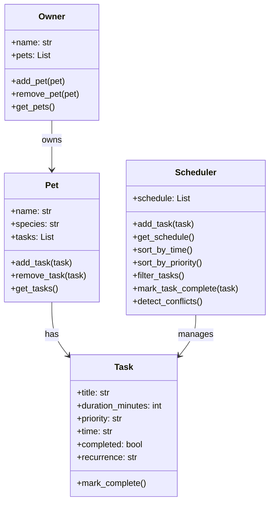
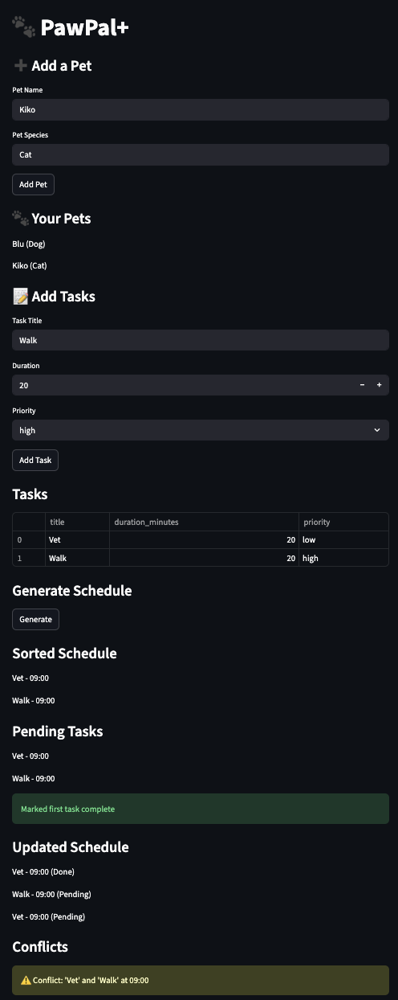

# PawPal+ (Module 2 Project)

You are building **PawPal+**, a Streamlit app that helps a pet owner plan care tasks for their pet.

## Scenario

A busy pet owner needs help staying consistent with pet care. They want an assistant that can:

- Track pet care tasks (walks, feeding, meds, enrichment, grooming, etc.)
- Consider constraints (time available, priority, owner preferences)
- Produce a daily plan and explain why it chose that plan

Your job is to design the system first (UML), then implement the logic in Python, then connect it to the Streamlit UI.

## What you will build

Your final app should:

- Let a user enter basic owner + pet info
- Let a user add/edit tasks (duration + priority at minimum)
- Generate a daily schedule/plan based on constraints and priorities
- Display the plan clearly (and ideally explain the reasoning)
- Include tests for the most important scheduling behaviors

## Getting started

### Setup

```bash
python -m venv .venv
source .venv/bin/activate  # Windows: .venv\Scripts\activate
pip install -r requirements.txt
```

### Suggested workflow

1. Read the scenario carefully and identify requirements and edge cases.
2. Draft a UML diagram (classes, attributes, methods, relationships).
3. Convert UML into Python class stubs (no logic yet).
4. Implement scheduling logic in small increments.
5. Add tests to verify key behaviors.
6. Connect your logic to the Streamlit UI in `app.py`.
7. Refine UML so it matches what you actually built.

## Smarter Scheduling

In Phase 4, I improved the PawPal+ system by adding simple algorithms to make it more intelligent and useful.

- Tasks can now be sorted by time so the schedule is in the correct order.
- Tasks can be filtered by pet or completion status to make it easier to manage.
- Recurring tasks (daily or weekly) are automatically added again when completed.
- The system can detect conflicts when two tasks are scheduled at the same time and shows a warning.

These improvements make the scheduler more realistic and helpful for managing pet care tasks.

## Features

- Add and manage multiple pets  
- Add tasks with duration, priority, and time  
- Sort tasks automatically by time  
- Filter tasks by pet and completion status  
- Detect scheduling conflicts (same time tasks)  
- Support recurring tasks (daily/weekly)  
- Automatically create new tasks when recurring tasks are completed  
- View updated schedule after completing tasks  

## UML Diagram


---
## Demo



## Testing

Run tests using:

python3 -m unittest discover tests
